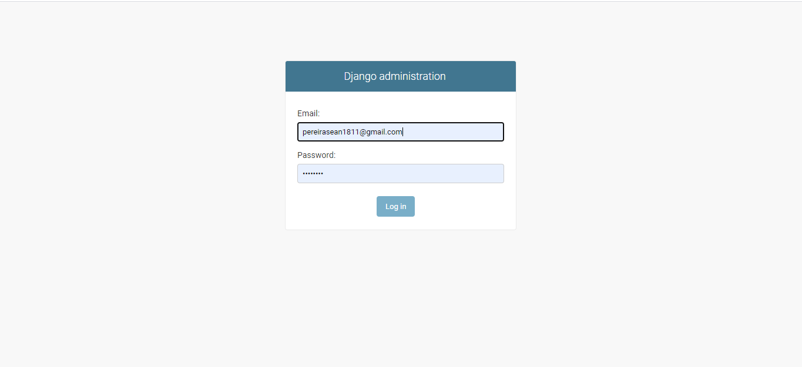
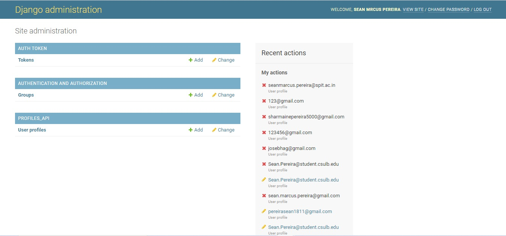
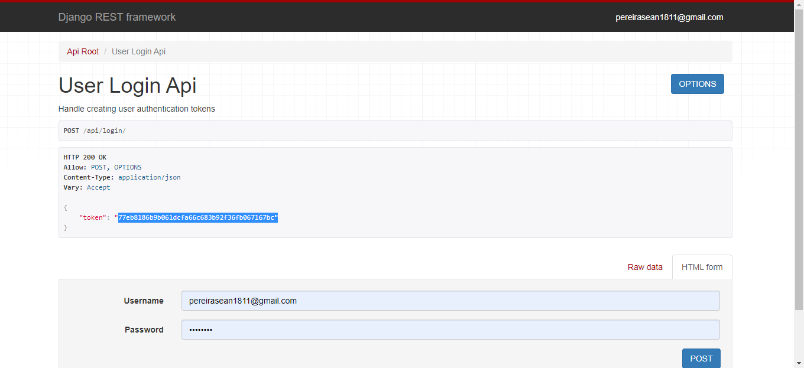
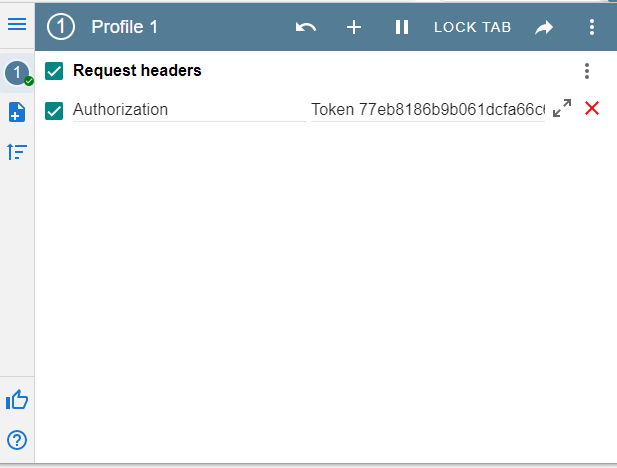
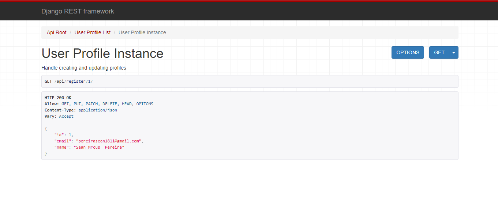
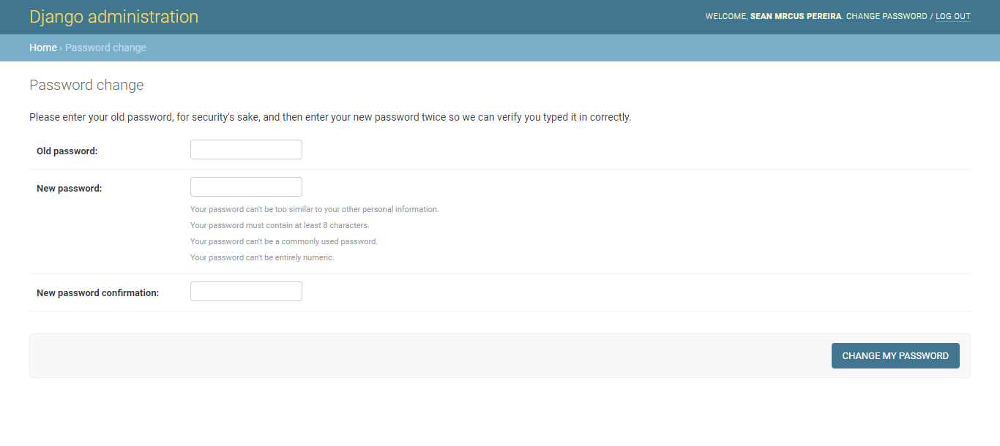
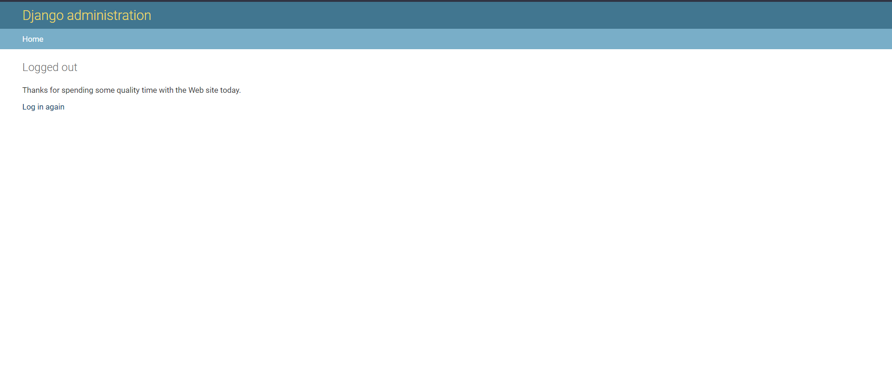

# PYTHON DJANGO PROJECT

  <ol>
  <li>To install all the dependencies for the project, use this command on your local machine terminal- pip install -r requirements.txt</li>
  <li>Superuser credentials</li>
    <ul>
      <li>Email: pereirasean1811@gmail.com</li>
      <li>Name: Sean Pereira</li>
      <li>pass: pass1234</li>
    </ul>
  
   ## preview of the Admin login page
  
      

  <li> In this project, to unable token authorization, you will have to add a browser extension called ModHeader; this is the link where you can download https://chrome.google.com/webstore/detail/modheader/idgpnmonknjnojddfkpgkljpfnnfcklj?hl=en</li>
  </ol>
  
 ## How to run the project
 
  <ol>
  <li> run python manage.py runserver command in your command prompt to start the Django app</li>
  <li> Paste http://127.0.0.1:8000/admin/ in your browser and enter your superuser credentials</li>
  
  ## preview of the Admin Dashboard
  
  
  
  <li> To view all the API list, put this endpoint in the browser: http://127.0.0.1:8000/api/ </li>
  
  <li> To view all the profile's created, put this endpoint in the browser: http://127.0.0.1:8000/api/profile/ </li>
  
  <li> To edit information like the following details mentioned below, but the following endpoint http://127.0.0.1:8000/api/profile/1/ '1' indicates the id of that user </li>
         <ul>
            <li> Email </li>
            <li> Name  </li>
            <li> Password </li>
      </ul>
      
   <li> To add a new user and authenticate it, you need to add the following endpoint http://127.0.0.1:8000/api/login/ </li>
   
   <li> Following that, you will get a token for that user, which will enable that user to edit his/her profile. </li>
   
   <li> Copy that token in the Mode header extension. Following are the steps to put the token in the ModHeader </li>
         <ul>
            <li> Click on the ModHeader symbol in your browser. </li>
            <li>  Click on the "+" symbol add the token  </li>
            <li>  In the name section add Authorization and the value section add " Token 77eb8186b9b061dcfa66c683b92f36fb067167bc" for example for example</li>
         </ul>
      
  ## preview of the login and Token authorization
  
  
  
  ## preview of the ModHeader 
   
   
 <li> Once the user is authorized, he/she can edit their profile and change their name, password, and email address. </li>
  
  <li> To log-out, use the following endpoint: http://127.0.0.1:8000/admin/logout/ and uncheck the token in the MoD header. </li>
  
  <li> Now, if the user wants to edit their profile by logging in and going to their profile section, e.g., http://127.0.0.1:8000/api/profile/1/, they will not be able to edit their profile they do not have authorization or the required token enables. </li>
      
 ## preview after turning off token authorization in Modheader
   
   
   
<li> To change your password, you can use this endpoint: http://127.0.0.1:8000/admin/password_change/   </li>
    <ul>
      <li> You need to put your previous password correctly to change your password </li>
  </ul>
  
 ## preview of changing password
   
   
<li> To login with a newly registered user using Django admin, you need to logout from your current profile using http://127.0.0.1:8000/admin/logout/. </li>
    <ul>
        <li> Then login back using http://127.0.0.1:8000/admin/ endpoint </li>
    </ul>

 ## preview after logout
   
   
  </ol>
  

  
